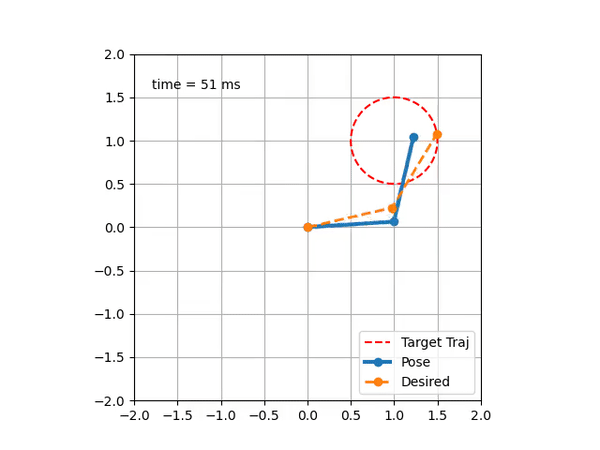
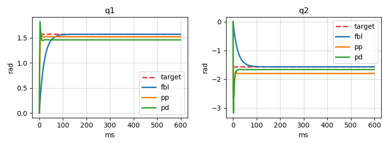
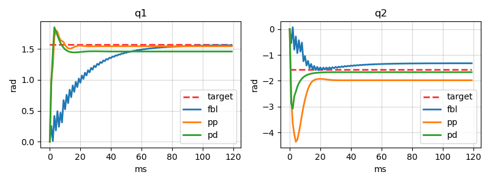
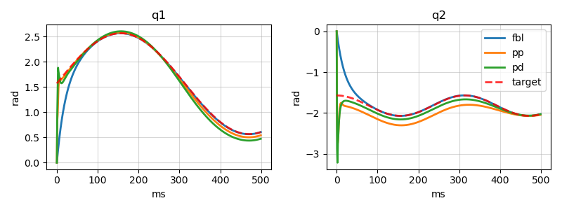
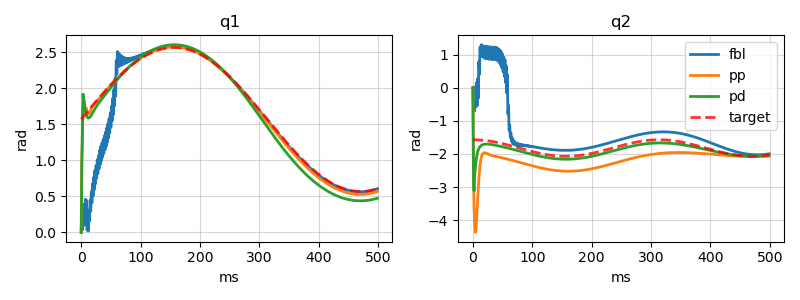

# Trajectory Tracking Control via Decentralized Joint-Level Schemes

  
   
  Model Mismatch with Centralized Control (FBL)

## Introduction
Please refer to the [report](ttc_decentralized.pdf).

## Some Results

__Regulation__

- __Nominal case__

- __Model Mismatch case__

__Trajectory Tracking__

- __Nominal case__

- __Model Mismatch case__

## Usage
Experiments can be performed using the [exp_main.m](script_exp/exp_main.m) MATLAB file. 
Many parameters can be individually chosen, e.g. dynamic params of the 2R manipulator, controllers gains, etc.
Moreover, available controllers in the `lib_ctrl` directory are:

- __Feedback Linearization Control__ ([FBL](lib_ctrl/controller_fbl.m))
- __Proportional-Derivative Control__ ([PD](lib_ctrl/controller_pd.m))
- __Pole Placement Control__ ([PP](lib_ctrl/controller_pp.m))
- __Pole Placement Control + Disturbance rejection__ ([PP_ER](lib_ctrl/controller_pp_er.m))
- __Pole Placement + Sliding Mode Control__ ([PP_SMC](lib_ctrl/controller_pp_sm.m))
- __LQR__ ([LQR](lib_ctrl/controller_lqr.m))
 
## Credits
- [Riccardo Caprari](https://github.com/RickyMexx)
- [Emanuele Giacomini](https://github.com/EmanueleGiacomini)

## References
- J.Y.S. Luh, "Conventional controller design for industrial robots — A tutorial", IEEE Trans. on Systems, Man and Cybernetics, vol. 13, no. 3, pp. 298-316, 1983.
- T.C.S. Hsia, T.A. Lasky, and Z. Guo, "Robust independent joint controller design for industrial robot manipulators", IEEE Trans. on Industrial Electronics, vol. 38, no. 1, pp. 21-25, 1991.
- "Motion Control", Chapter 8 in Springer Handbook of Robotics, 2012.
- "Robotics: Modelling, Planning and Control", Chapters 5 and 8, 2009. 
- M. Noh Ahmad, J. H. S. Osman and M. Ruddin A Ghani, "A decentralized proportional-integral sliding mode tracking controller for robot manipulators," 2002 IEEE Region 10 Conference on Computers, Communications, Control and Power Engineering. TENCOM '02. Proceedings., Beijing, China, 2002, pp. 1314-1317 vol.3, doi: 10.1109/TENCON.2002.1182568.
- Ouyang P. R., Acob J., Pano V., PD with sliding mode control for trajectory tracking of robotic system, Robotics and Computer-Integrated Manufacturing, 2014, 30(2), pp. 189-200.
- Kara, Tolgay & Mary, Ali. (2017). Adaptive PD-SMC for Nonlinear Robotic Manipulator Tracking Control. Studies in Informatics and Control. 26. 49-58. 10.24846/v26i1y201706. 
- Rocco P., Decentralized control lesson, Control of industrial robots, Politecnico di Milano, 2020.
